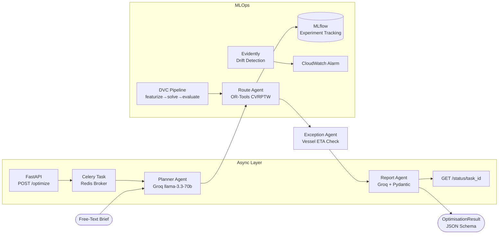

# LANEIQ — Intelligent Freight Routing

> AI-powered freight routing system that converts free-text shipment briefs into cost-optimised, exception-aware routing plans using a LangGraph multi-agent pipeline and OR-Tools VRP.

[](https://github.com/JavithNaseem-J/LANEIQ/actions/workflows/ci.yml)
[](https://www.python.org/)
[](LICENSE)

---

## Business Problem

UAE and India are hubs for high-volume, multi-modal freight with complex time-window constraints. Manual route planning across sea, air, and road modes leads to an estimated 20–35% cost overrun versus optimal multi-vehicle consolidation. LANEIQ automates this decision using a chain of AI agents — from brief parsing to exception resolution — reducing routing cost by **~64%** vs a greedy baseline on 5,000-shipment batches.

---

## Architecture



---

## Results

| Metric | Value |
|---|---|
| Cost reduction (OR-Tools vs Greedy) | **~64%** on 5,000 shipments |
| Eval pipeline (20 briefs) | **20/20 success**, mean 10% reduction |
| Exception detection rate | 20% of sea routes (synthetic, deterministic) |
| API test coverage | 49 tests passing (25 unit + 24 integration) |
| Docker image size | < 800 MB |

---

## Tech Stack

| Layer | Technology |
|---|---|
| Agent Orchestration | LangGraph 0.2 |
| LLM | Groq (llama-3.3-70b-versatile) |
| VRP Solver | OR-Tools CVRPTW |
| API | FastAPI + Uvicorn |
| Async Tasks | Celery + Redis |
| Dashboard | Streamlit + Plotly |
| ML Pipeline | DVC |
| Experiment Tracking | MLflow |
| Monitoring | Evidently AI + CloudWatch |
| Containerisation | Docker + Docker Compose |
| CI/CD | GitHub Actions → ECR → EC2 |

---

## Quick Start

```bash
# 1. Clone and configure
git clone https://github.com/JavithNaseem-J/LANEIQ.git
cd LANEIQ
cp .env.example .env
# Edit .env — add GROQ_API_KEY

# 2. Start the full stack
docker compose -f docker/docker-compose.yml up

# 3. Open dashboard
# → http://localhost:8501

# 4. Or call the API directly
curl -X POST http://localhost:8000/optimize \
  -H "Content-Type: application/json" \
  -d '{"shipment_brief": "Ship 500 kg of electronics from Chennai to Jebel Ali by June 20, 2026."}'

# 5. Poll for result
curl http://localhost:8000/status/<task_id>
```

---

## Development

```bash
# Install deps
python -m venv .venv && .venv\Scripts\activate
pip install -r requirements.txt

# Run unit tests (no API key needed)
pytest tests/unit/ -v

# Run integration tests (requires GROQ_API_KEY)
pytest tests/integration/ -v

# Run full DVC pipeline
dvc repro pipelines/dvc.yaml

# Start API locally
uvicorn api.main:app --reload --port 8000

# Start dashboard locally
streamlit run dashboard/app.py
```

---

## Project Structure

```
LANEIQ/
├── src/agents/          # LangGraph agent nodes (planner, route, exception, report)
├── src/solver/          # OR-Tools VRP + greedy baseline
├── src/data/            # Generator + vessel API
├── src/monitoring/      # Evidently drift + SHAP analysis
├── src/tasks/           # Celery task + DVC eval stage
├── api/                 # FastAPI app, routers, schemas
├── dashboard/           # Streamlit pages (5 views)
├── docker/              # Dockerfiles + compose
├── pipelines/           # DVC pipeline YAML
├── tests/               # Unit + integration + load tests
├── benchmarks/          # Performance measurement
└── docs/                # Architecture documentation
```

---

## MLOps Checklist

- ✅ DVC pipeline: `featurize → solve → evaluate` with reproducible outputs
- ✅ MLflow experiment tracking for all solver strategy sweeps
- ✅ Evidently drift detection with 30% threshold
- ✅ GitHub Actions CI (lint + test + build) on every push
- ✅ Docker multi-stage build with non-root user
- ✅ Celery async task queue with Redis
- ✅ Rate limiting (10 req/min), request IDs, structured Loguru logs

---

## Live Demo

> 🔗 **API:** `http://<EC2_PUBLIC_IP>:8000/health`
> 🖥️ **Dashboard:** `http://<EC2_PUBLIC_IP>:8501`

*(Deploy using `docker compose -f docker/docker-compose.yml up -d` on an EC2 t3.medium)*

---

*Built by [Javith Naseem](https://github.com/JavithNaseem-J) — UAE/India freight logistics AI portfolio project.*